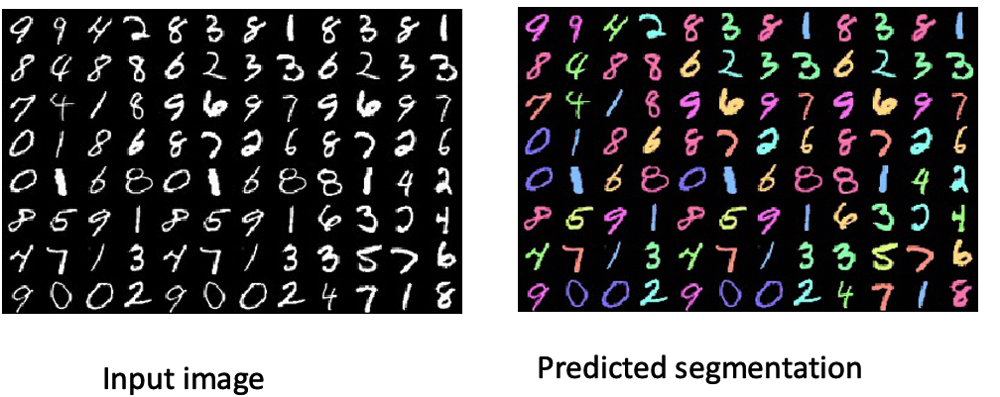

Semantic segmentation training for images based on tensorflow keras. It
supports segmentation of multiple classes. it provides easy interface
for training. Just put images and labels in the given format in a
folder.

Steps:
* Prepare the data in a given format 
  *   Label maps should be of a gray scale image where each pixel
      contains value of the class label. If the segmentaion problem have
      C classes then the value of the label map pixel can range from [0
      to C -1)
  * Example mnist data for multiclass segmentation can be generated
    using mnist_generate_data.py
    
*  Define a configuration class for your experiment and put the training
   images and label map path. Define your experiment name, log path and
   other trainining parameters.  

* Pass the configuration to the training function. Example training
  script : train_mnist.py
  
* All the training results will be saved in
  config.LOG_ROOT_DIR/config.NAME directory. This included visualization
  of segmentation of each epoch and losses.
 

This code requires tensorflow verion >= 2.2 and python version >=3.6.

There are several examples of training/evaluation:
* Skin cancer images segmentation on ISIS dataset: train_isic_segmentation.py
* Retinal layers segmentation on Duke OCT dataset: train_octlayers_segmentation.py
* Handwritten digit segmentation on 10 classes on MNIST data: train_mnist_segmentation.py
 
 
  
 
